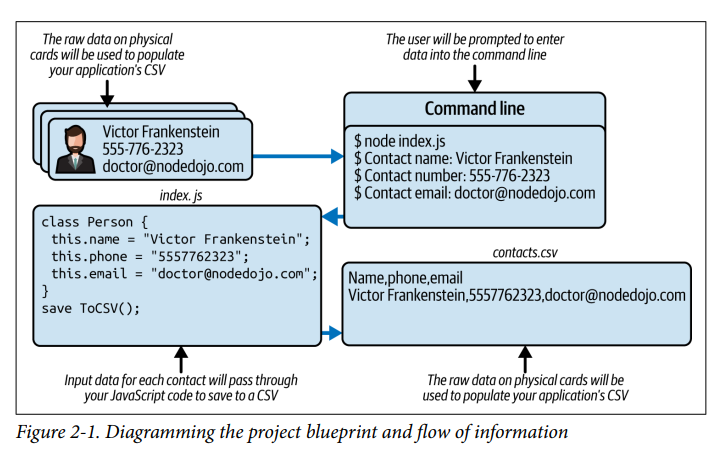

# Contact API

## Question Prompt

A travel agent wants to hire you to convert their Rolodex (physical information cards)
into some digital format. They just bought a few new computers and want to start
importing data. They don’t need anything fancy like a website or mobile application,
just a computer prompt to create a tabular format, or comma-separated values (CSV),
of data.

## Get Planning

The diagram details the following steps:

1. Physical information cards are collected by the user.
2. Open the command line and start the application by running `node index.js`.
3. Enter the name, phone number, and email address in the command-line prompt.
4. After each entry, contact data is saved through your application to a CSV file on your computer.

## Program flow

# contact-converter-api
